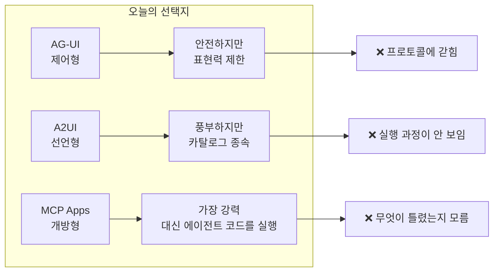
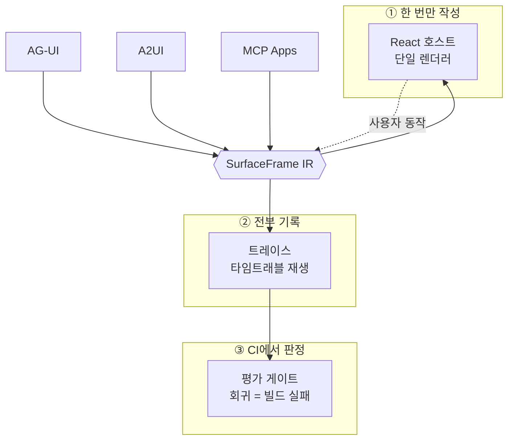
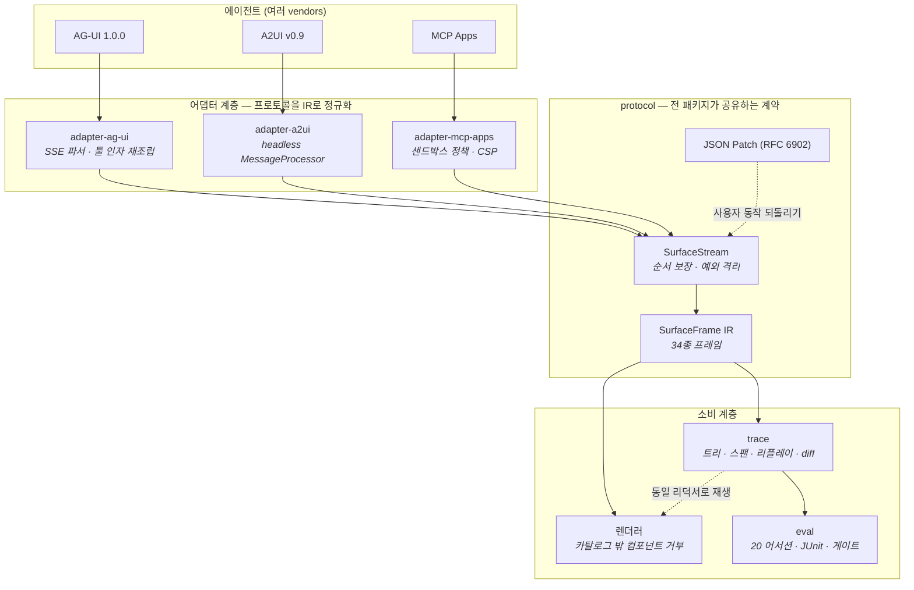
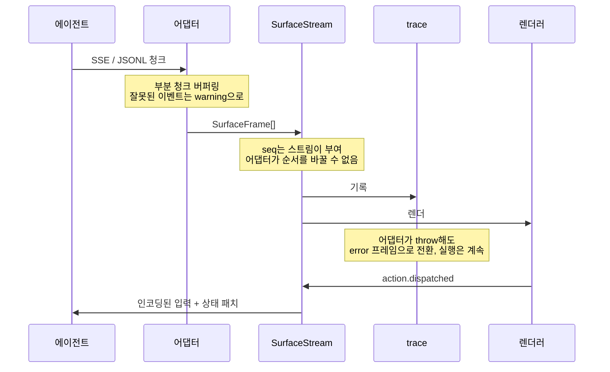
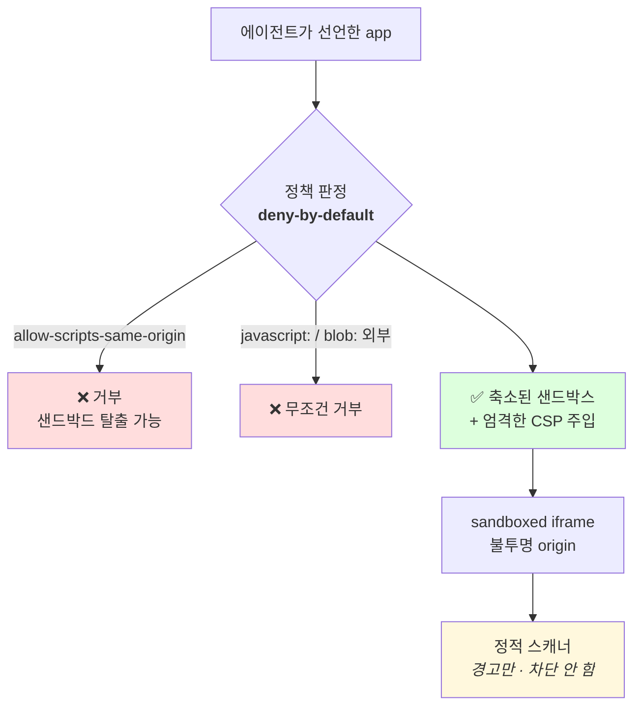
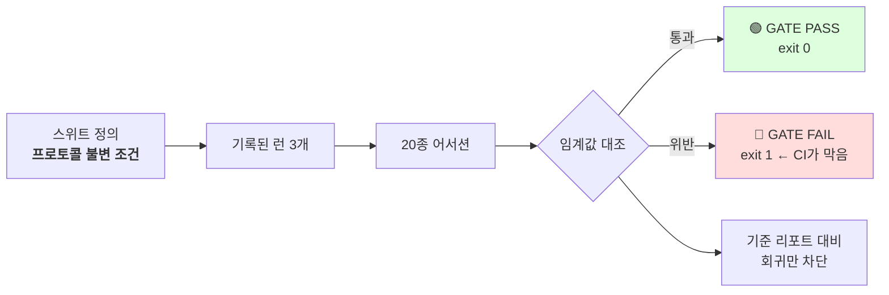
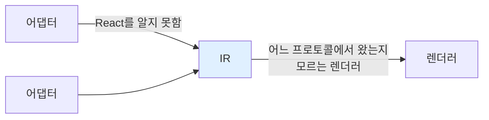
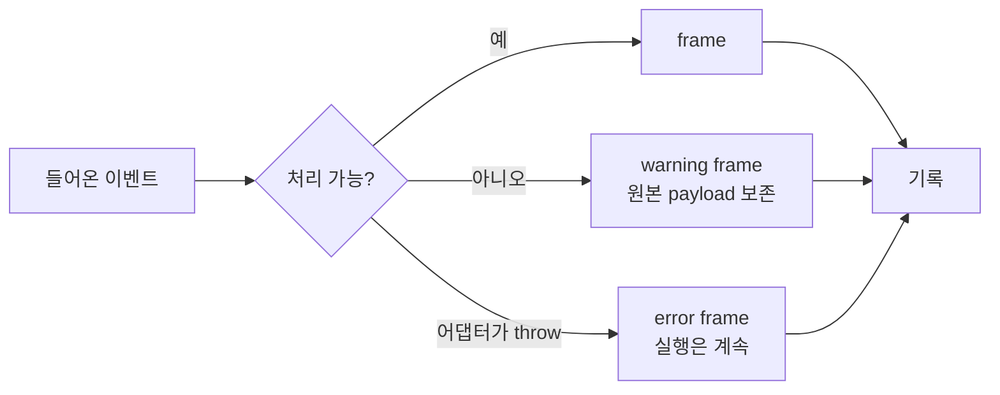

<div align="center">

# agent-surface

**에이전트 프로토콜 3종을 하나의 렌더러로 · 실행 과정을 전부 기록하고 · 품질을 CI에서 게이트**

[](https://github.com/kimjusnu/agent-surface/actions/workflows/ci.yml)
[](https://github.com/kimjusnu/agent-surface)
[](LICENSE)

[시작하기](#시작하기) · [아키텍처](#아키텍처) · [설계 결정](#설계-결정) · [기여하기](#기여하기)

</div>

---

## 이 프로젝트가 푸는 문제

에이전트를 화면에 붙이려면 지금 세 갈래 중 하나를 골라야 합니다.



세 갈래를 고르면 세 가지 손해가 따라옵니다. 렌더러를 하나만 고르면 다른 프로토콜로 넘어갈 수 없고, 화면에 보이는 결과물만 보면 에이전트가 실제로 뭘 했는지 알 수 없으며, 프롬프트를 바꿨을 때 회귀인지 개선인지 구분할 방법이 없습니다.

`agent-surface`는 이 셋을 **동시에** 해결합니다.



> 화면은 한 번만 작성하고, 실행 과정은 전부 남기고, 품질 판단은 CI가 합니다.

---

## 아키텍처

### 전체 흐름



### 한 개 프로토콜이 프레임으로 바뀌는 순간



### 신뢰 경계

에이전트가 만들어낸 앱은 **코드**다. 이 경계가 설계의 핵심입니다.



> **정적 스캐너가 차단하지 않는 이유** — 호위적이 아닌 HTML에 대한 정규식은 과잉 탐지와 누락을 모두 만듭니다. 오탐으로 렌더를 막으면 그건 호스트 DoS 버그입니다. **CSP가 강제하고, 스캐너는 감사 기록만 남깁니다.**

---

## 패키지

| 패키지 | 역할 | 테스트 |
|---|---|---|
| [`@agent-surface/protocol`](packages/protocol) | **계약.** `SurfaceFrame` IR, 순서 보장 스트림, 헤드리스 서피스 평가, JSON Patch, 프로토콜 협상 | 22 |
| [`@agent-surface/adapter-ag-ui`](packages/adapter-ag-ui) | AG-UI 1.0.0 이벤트 → IR. 자체 SSE 파서, 스트리밍 툴 인자 재조립 | 128 |
| [`@agent-surface/adapter-a2ui`](packages/adapter-a2ui) | A2UI v0.9 JSONL → IR. zod 스키마 너머의 의미 검증 | 91 |
| [`@agent-surface/adapter-mcp-apps`](packages/adapter-mcp-apps) | MCP Apps → IR + 샌드박스 정책 엔진, CSP 주입, postMessage 브리지 | 141 |
| [`@agent-surface/trace`](packages/trace) | 기록기, 실행 트리, 타임트래블 리플레이, OTel GenAI 스팬, 런 diff, 비밀 마스킹 | 59 |
| [`@agent-surface/eval`](packages/eval) | 어서션 20종, YAML 스위트, LLM-as-judge, JUnit 리포트, CI 게이트 | 49 |

<details>
<summary><b>제공 어서션 전체 목록</b></summary>

`no-errors` · `no-warnings` · `no-input-errors` · `run-finished` · `tool-called` ·
`tool-not-called` · `tool-count` · `tool-args-match` · `tool-no-error-result` ·
`text-contains` · `text-matches` · `text-not-contains` · `surface-has-component` ·
`surface-max-depth` · `surface-max-nodes` · `data-model-matches` ·
`action-dispatched` · `max-latency` · `max-tool-latency` · `max-cost` ·
`token-budget` · `no-retry-storm` · `interrupt-answered` · `subagent-completed` ·
`llm-judge` · `custom`

</details>

---

## 시작하기

```bash
pnpm install
pnpm check          # 타입체크 + 테스트 490개
```

### 게이트 실행 — API 키 불필요

```bash
node packages/eval/bin/eval.mjs \
  --suite packages/eval/suites/demo.yaml \
  --runs "packages/eval/src/fixtures/*.json"
```



> 동봉된 fixture 3개 중 **2개는 의도적으로 실패합니다.** 게이트를 통과하는 데모는 잘못된 것을 가르치기 때문입니다.

```bash
node packages/eval/bin/eval.mjs --list-asserters   # 어서션 목록
node packages/eval/bin/eval.mjs --help             # 전체 옵션
```

<details>
<summary>실제 게이트 출력 (일부)</summary>

```
✗ refund/tool-resilience    3/3
    ✗ tool-no-error-result — 3 tool results returned isError
    ✗ no-retry-storm — 3 consecutive fetch_order failures exceed the limit of 2
    ✗ no-warnings — 1 warning frame (CATALOG_PARTIAL: …)
✗ escalation/cost-control   3/3
    ✗ token-budget — input 210000 > 120000, total 270000 > 150000
    ✗ max-cost — $7.6500 (estimated) exceeds $1.0000

6 passed · 6 failed · 0 skipped · 12 case(s)
GATE FAIL (6 violation(s))   → exit 1
```

</details>

---

## 설계 결정

문맥 없이 보면 이상해 보이는 판단들. 이유까지 적어 둡니다.

### IR이 유일한 계약이다



어댑터는 React를 모르고, 렌더러는 프레임의 출처를 모릅니다. `SurfaceStream`이 `seq`를 소유하므로 서드파티 어댑터도 순서를 망가뜨릴 수 없습니다.

### 어댑터는 hostile input을 정상으로 취급한다

버그가 난 에이전트는 예외 상황이 아니라 **정상 운영 상태**입니다. 처리하지 못한 이벤트는 조용히 버리지 않고 `warning` 프레임으로 남깁니다 — 트레이서가 "무언가 있었다"는 걸 알아야 기록이 맞아떨어집니다.



### 판정은 게이트가, 네트워크는 CI가 쓰지 않는다

`llm-judge`는 **기본이 결정론적 오프라인 모드**입니다. CI가 네트워크에 의존하면 안 되고, 채점기가 흔들리면 실제 회귀와 구분할 수 없기 때문입니다. 네트워크 모드 호출이 깨지면 실패가 아니라 오프라인 점수로 되돌아갑니다.

주체가 맞는 런이 하나도 없으면 결과는 `passed`가 아니라 **`skipped`** 입니다. 없는 기록이 성공처럼 보이면 안 됩니다.

---

## 기여하기

| 규칙 | 내용 |
|---|---|
| 브랜치 | `영역/설명` — 예: `feat/렌더러-카탈로그`, `fix/trace-고아도구` |
| 커밋 | 한국어. 끝에 `Co-authored-by:` 줄을 붙입니다 |
| PR | 템플릿을 채우고 라벨을 `영역:*` · `종류:*`로 단다 |
| 검증 | `pnpm check` 통과 필수. `master`는 보호되어 PR 경유로만 머지됩니다 |

```bash
git switch -c feat/내-작업
# ... 작업 ...
pnpm check
git commit -m "설명" -m "Co-authored-by: ..."
git push -u origin feat/내-작업
gh pr create --fill && gh pr merge --merge --delete-branch
```

<details>
<summary>강제되는 코딩 규칙</summary>

- TypeScript `strict` + `noUncheckedIndexedAccess` + `verbatimModuleSyntax`
- ESM 전용, 상대 임포트에 `.js` 확장자
- **주석은 코드를 되읽지 않습니다.** 결정의 이유나 스펙 인용만 씁니다

</details>

---

## 진행 상황

| 완료 | 남음 |
|---|---|
| IR 계약 + 스트림 + JSON Patch | — |
| 프로토콜 어댑터 3종 | — |
| 샌드박스 정책 엔진 | 원격 `https:` 프레임 CSP 경로 |
| 트레이스 · 리플레이 · 스팬 · diff · 마스킹 | 실시간 스트리밍 뷰 |
| 평가 엔진 + CI 게이트 | 실제 에이전트에서 녹화한 런 |
| CI (타입 + 테스트 + 게이트) | React 렌더러 · 데모 앱 · 배포 |

다음 단계와 알려진 거친 모서리는 [`docs/working-notes.md`](docs/working-notes.md)에 있습니다.

---

## 라이선스

MIT
